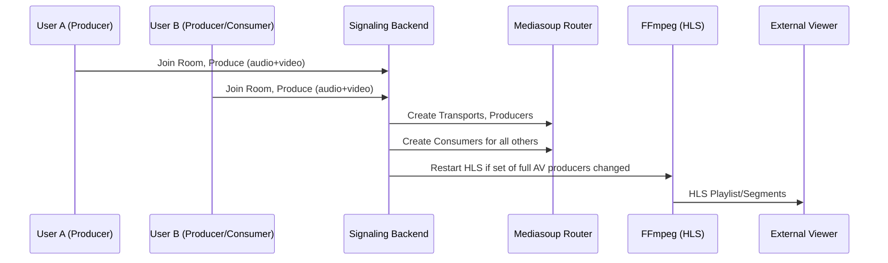

# Mediasoup SFU + HLS/FFmpeg Signaling Backend

A robust Node.js/TypeScript backend for real-time, multi-user video/audio rooms built with [Mediasoup](https://mediasoup.org/), supporting **bi-directional conferencing for room participants (SFU)** and **scalable HLS output (via FFmpeg) for external viewers**.

---

## Table of Contents

1. [Overview](#overview)
2. [Architecture](#architecture)

   * [High-Level Flow](#high-level-flow)
   * [Key Components](#key-components)
   * [Room Lifecycle](#room-lifecycle)
   * [Producer/Consumer Model](#producerconsumer-model)
   * [HLS Output Pipeline](#hls-output-pipeline)
3. [Why Serialization is Critical](#why-serialization-is-critical)
4. [API/Function Reference](#apifunction-reference)

   * [Room Management](#room-management)
   * [Mediasoup Transport Management](#mediasoup-transport-management)
   * [Producer/Consumer Management](#producerconsumer-management)
   * [HLS/FFmpeg Pipeline Management](#hlsffmpeg-pipeline-management)
5. [Flow Diagrams](#flow-diagrams)
6. [Development/Running Locally](#developmentrunning-locally)
7. [Troubleshooting & FAQs](#troubleshooting--faqs)
8. [Credits & License](#credits--license)

---

## Overview

This backend implements a multi-user, scalable video conferencing system with two modes of participation:

* **Room Participants:**
  Any user who joins a room can produce (send) and consume (receive) real-time video/audio via Mediasoup SFU. The system supports *N* producers and *N* consumers per room.
* **HLS Viewers (External):**
  All media from active room producers is combined/transcoded by FFmpeg into an HLS (HTTP Live Streaming) stream, accessible to large numbers of viewers with minimal backend load.

**Not a mesh!** This is a **Selective Forwarding Unit (SFU)** model: each user sends media to the server, which routes it to others and also processes it for HLS.

---

## Architecture

### High-Level Flow

```mermaid
flowchart LR
  subgraph Room
    U1[User 1 (producer/consumer)]
    U2[User 2 (producer/consumer)]
    U3[User N (producer/consumer)]
    Router[Mediasoup Router]
    FF[FFmpeg/HLS]
    U1 -->|WebRTC| Router
    U2 -->|WebRTC| Router
    U3 -->|WebRTC| Router
    Router -- A/V RTP --> FF
  end

  Viewer1[External HLS Viewer]
  Viewer2[External HLS Viewer]
  FF -- HLS playlist/files --> Viewer1
  FF -- HLS playlist/files --> Viewer2
```

#### Key Points:

* Room participants can both produce and consume media, via Mediasoup’s SFU router.
* External viewers receive a single transcoded HLS stream (from all active participants’ audio + video), generated by FFmpeg.

---

### Key Components

* **Mediasoup Router:**
  Handles all real-time WebRTC traffic per room. Manages WebRtcTransports, Producers (media sources), and Consumers (media sinks).
* **Socket.IO:**
  Used for signaling: room join/leave, create transport, produce/consume media, etc.
* **FFmpeg:**
  Reads raw RTP from Mediasoup via "plain" transports, composites all AV streams, and generates a live HLS stream (playlist + segments).
* **Room State Management:**
  Tracks all users, transports, producers, and the current HLS output state per room.
* **Serialization Logic:**
  Ensures the HLS/FFmpeg pipeline is always restarted cleanly and never overlaps, preventing race conditions and resource leaks.

---

### Room Lifecycle

1. **Create Room:**
   First user creates a new room; Mediasoup router is created.
2. **Join Room:**
   Any number of users can join. Each manages their own WebRTC transports.
3. **Produce Media:**
   Any participant can start sending audio and/or video (becoming a "producer").
4. **Consume Media:**
   All participants can consume any or all producers in the same room (except their own).
5. **HLS Pipeline:**
   Whenever the set of active producers changes, the HLS pipeline is (re)started to reflect the new set.
6. **Room End/Cleanup:**
   When all users leave, room and all associated resources are destroyed.

---

### Producer/Consumer Model

* Each participant can produce audio and/or video.
* Each participant can consume media from all other producers in the room.
* The backend ensures each user only has **at most one audio and one video producer at a time**.

---

### HLS Output Pipeline

* Whenever at least one user is producing both audio and video, the server:

  1. Creates new Mediasoup **plain transports** and **consumers** for each full AV producer.
  2. Binds those transports to new UDP ports.
  3. Generates an SDP file listing all AV RTP streams.
  4. Launches (or restarts) FFmpeg with that SDP, which composites/mixes all inputs and outputs an HLS stream.
* If no user is producing both audio and video, HLS output is stopped.

---

## Why Serialization Is Critical

### Problem

HLS restarts require cleaning up and recreating transports, consumers, FFmpeg, and SDP all together, atomically.
If two (or more) changes happen back-to-back (user joins/leaves, stops/starts producing), restarts **must not overlap**—or the system could create race conditions, resource leaks, orphaned processes, or black video in the output.

### Solution: Safe Serialization

We use a **serialized, lock-free approach**:

* **Only one HLS pipeline restart runs per room at a time**
* If any new event requires a restart while one is running, we mark a pending restart to run immediately after the current one finishes
* This guarantees the system is always consistent, and all changes are eventually processed

### Why Not Just setTimeout?

A naive debounce (e.g., setTimeout) does not guarantee serialization; rapid changes could still overlap and break the pipeline.
This code uses robust async state tracking for bulletproof reliability.

---

## API/Function Reference

### Room Management

#### `handleCreateRoom(socket, cb)`

* Creates a new room, Mediasoup router, initializes state.
* Responds with the new roomId.

#### `handleJoinRoom(socket, io, { roomId }, cb)`

* Adds a user to an existing room.
* Emits updated producer list to all room members.

---

### Mediasoup Transport Management

#### `handleCreateTransport(socket, { roomId }, kind, cb)`

* Creates a WebRtcTransport for the given user and kind (`producer` or `consumer`).
* Responds with ICE and DTLS parameters for client negotiation.

#### `handleConnectTransport(socket, { roomId, dtlsParameters }, kind, cb)`

* Connects an existing transport to complete DTLS handshake.

---

### Producer/Consumer Management

#### `handleProduce(socket, io, { roomId, kind, rtpParameters }, cb)`

* Creates a new producer (audio or video) for the user.
* Closes any previous producer of that kind.
* Triggers a (serialized) HLS pipeline restart.

#### `handleStopProducing(socket, { roomId }, cb)`

* Stops all producers for the user.
* Triggers an HLS pipeline restart.

#### `handleListProducers(socket, { roomId }, cb)`

* Returns all other producers in the room (for client-side consumption).

#### `handleConsume(socket, { roomId, producerId, rtpCapabilities }, cb)`

* Creates a consumer for the given producer and returns all params for client-side setup.

---

### HLS/FFmpeg Pipeline Management

#### `safeRestartRoomHls(roomId, room)`

* Public, serialized entrypoint to the HLS restart process.
* Guarantees only one pipeline restart runs per room at once.
* Queues a second restart if another change happens mid-restart.

#### `restartRoomHls(roomId, room)`

* Internal, low-level function: tears down and rebuilds all plain transports, consumers, SDP, and FFmpeg processes as needed.

#### `launchFfmpeg(roomId, { audioPorts, videoPorts })`

* Creates the correct SDP file, then spawns FFmpeg to read all RTP streams and produce HLS output.

---

## Flow Diagrams

### Core SFU + HLS System



---

## Development/Running Locally

### Prerequisites

* Node.js (v18+ recommended)
* FFmpeg installed and available in `$PATH`
* [Mediasoup Worker](https://mediasoup.org/documentation/v3/mediasoup/worker/) built

### Getting Started

1. **Install dependencies:**

   ```bash
   npm install
   ```

2. **Run the backend:**

   ```bash
   npm run start
   ```

3. **Client**: Use your own WebRTC/Mediasoup client or fork [mediasoup-client-demo](https://github.com/versatica/mediasoup-demo) as a starting point.

4. **HLS Output:**
   HLS segments/playlist are written to `hls/<roomId>/index.m3u8`
   You can serve this directory over HTTP (e.g., with `serve` or `nginx`) for external viewing.

---

## Troubleshooting & FAQs

* **FFmpeg stuck at “Could not find codec parameters for stream (Video: vp8, yuv420p): unspecified size”?**

  * This means FFmpeg hasn’t received a keyframe yet. Double keyframe requests are sent on new video consumers to minimize this risk.
* **Why are restarts not instant after a participant leaves?**

  * The pipeline is always serialized; if multiple changes happen together, only the final state is used, ensuring clean resources.
* **Can I support more than two simultaneous producers?**

  * Yes, the code will mix all users who produce both audio and video; FFmpeg layout can be adapted as needed.
* **Can I use a different video codec?**

  * Update SDP and FFmpeg args in `launchFfmpeg.js` accordingly.

---

## Credits & License

* Built with [mediasoup](https://mediasoup.org/), [Socket.IO](https://socket.io/), and [FFmpeg](https://ffmpeg.org/)
* See LICENSE file for usage terms.

---

### Maintainer Notes

**Serialization logic is critical—do not remove or "simplify" unless you understand potential race conditions with async resource teardown and FFmpeg.**
For advanced scaling, run workers per room and isolate HLS outputs.

---

**Feel free to adjust, expand, or subdivide as your project evolves!
If you want a separate section on how to extend for recording or advanced layouts, let me know!**
